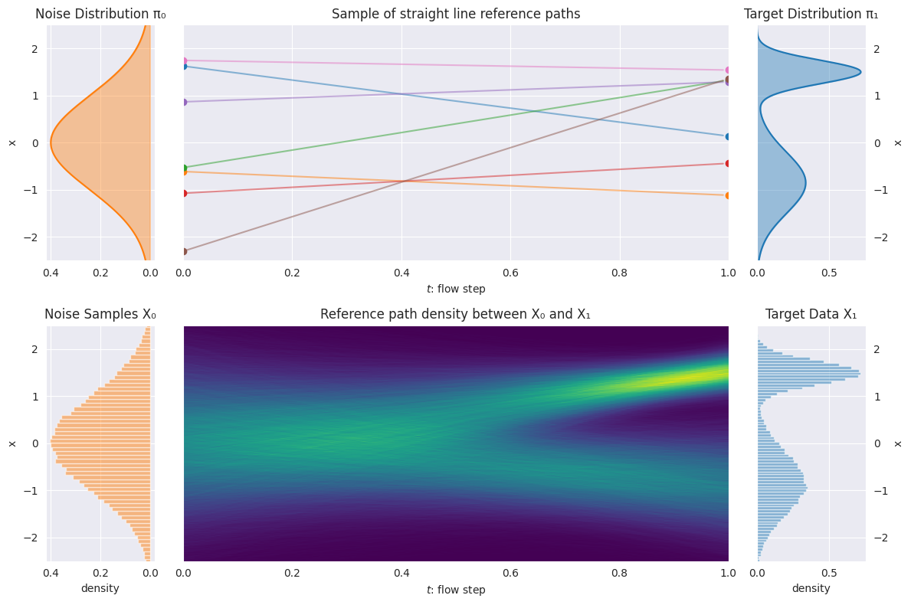

# Flow Matching

## Overview
Flow matching is another form of generative model (like diffusion), where flow in this case refers to how a point can *flow* along a path from one distribution in $\mathbb{R}^d$ to another distribution in $\mathbb{R}^d$. Following from this, flow matching can be thought of generally as a technique to learn how to transport samples from one distribution from another. For example, learning to transport samples from a simple distribution, like a unit Gaussian, to an action space of a robot.

A flow matching model does not do this by predicting flow paths directly. Instead it predicts a *velocity field*, which tells you at every given point and denoising step, how the sample must be nudged to reach the target distribution. The mathematical representation is given by: 

$FM(x_t, t) = v(x_t, t)$
 
where t is a value between 0 and 1 that describes the progress of the sample along the flow path (when t=0 it is the noisy sample, and at t=1 the sample is part of the target distribution). At inference time, a noisy sample is sampled from the starting distribution, and the velocity field is used to perform forward Euler integration until reaching the target distribution.

### Training
Training the flow matching model boils down to minimizing the reconstruction error of the velocity field. This is done by using a set of reference paths, the simplest, and one of the most common types thereof, being, straight line (i.e. rectified flow) refernce paths.

To sample these paths, independently sample from the noise and target distributions (target distributions come from expert collected data), making the conditional velocity vector sampled for this given pair the slope of the line. If we sample a large number of these pairs, we can see how they converge to distributing the noise samples to the target distribution. With this, our training objective becomes the minimization of the expectation of the error between the flow matching model and these conditional velocities, with the expectation being over time, and the independent samples from the start and target distributions. 

## Comparison to Diffusion
The benefits of diffusion is that it is an overall more mature technology, and due to the stochasticiy of the denoising/noising process, is more apt at handling very multi-modal processes. Flow matching on the other hand is much faster, and has a more straighforward objective function while training.