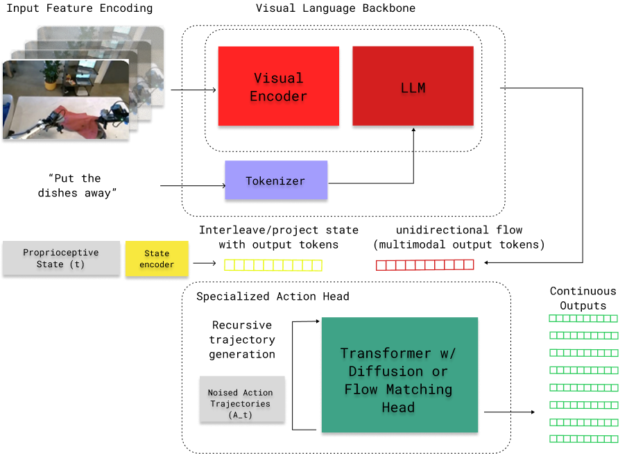

# Visual-Language-Action Models (VLA's)

## Overview
Typically built on top of transformers, VLA's are multi-modal foundation models that take as inputs visual input and natural language, and output actions. They typically have an architecture similar to the following:

The first major component is a backbone that takes in the scene and language, and embeds it into a latent space. Then, a variety of techniques are used as the *action head*, which takes in the latent representation and generates a *sequence* of actions (it is importnat to generate more than one action at a time so actions are correlated). Common action head architectures are diffusion, flow matching, or even LLM-like token outputs.

VLA's are normally trained in two stages: a pre-training phase, and a post-training phase. During pre-training the goal is to learn the foundational mapping from observations to action-relevant representations. The pre-training stage is often therefore done with large amount of expert demonstration data. During post-training, the goal is to finetune the pretrained model into a general task and embodiement sepcific policy (i.e. train the action head and finetune backbone params).

## SmolVLA
SmolVLA is Hugging Face's lightweight fouundation model (450M parameters) for robotics, which is designed to be easily fine-tuned on LeRobot datasets. SmolVLA has two main components: a pretrained VLM backbone trained on community data, and an action expert based upon flow matching. 

To post-train the VLA, you specify your embodiement by configuring the state and action spaces (including the camera streams), and how data is recieved/transmitted. This can be done by inheriting the RobotConfig class from LeRobot, fleshing out the state/observation and action spaces and how to send/recieve info, and registering the custom Robot in LeRobot. You then can then collect data in the standardized *LeRobotDataset* format and use this data to fine-tune your policy. For more information about SmolVLA, see the link [here](https://huggingface.co/blog/smolvla). Because of the integration with LeRobot, many data collection and dataset scripts and libraries are already provided.